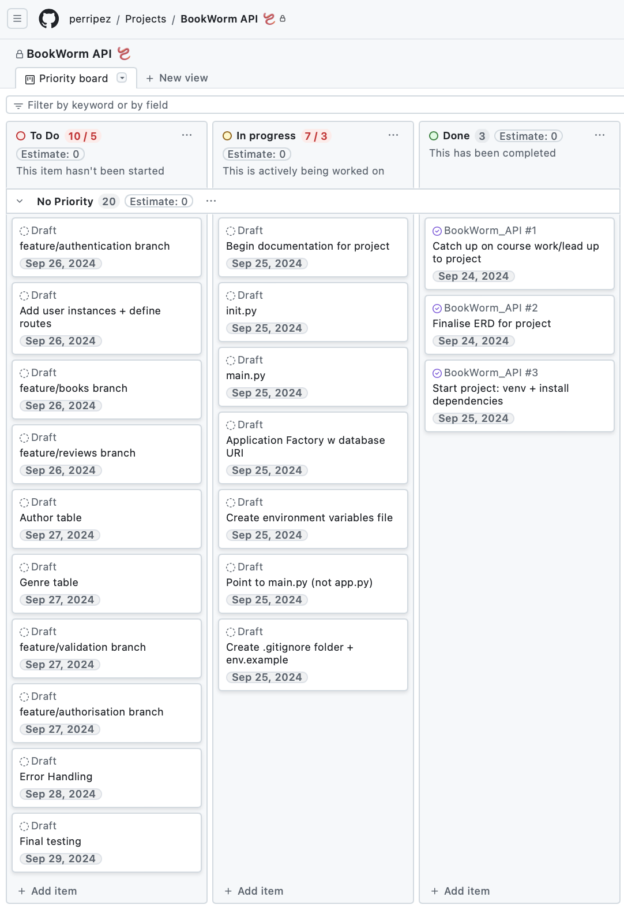

# BookWorm_API
## T2A3_PerriAdkins

### Explain the problem that this app will solve, and explain how this app solves or addresses the problem.

The BookWorm API solves the problem of tracking a keeping a consise book collection of reviewed books. A user will be able to login, add books to their collection (linked to Authors and Genres) and leave reviews for each book. 

To streamline the journey of creating a book collection, users will be able to sort through saved books with the following queries:

- Books: Title, Publication Year
- Reviews: 1, 2, 3, 4 or 5 star reviews (and view comments)
- Genres: Only a maximum of 5 of each genre can be added at once (Self Help, Comedy, Fantasy, Biography) to keep collection consise
- Authors: First and Last Name

This API will not only save time for the user, but also allow other users to view book reviews and comments before purchasing for themselves.

___

### Describe the way tasks are allocated and tracked in your project.

To track this project, I am using GitHub Projects. Similar to Trello, GitHub projects uses a Kanban model to allow smaller subtasks to be allocated to a 'To-Do', 'In Progress' and 'Done' column.

#### Screenshots of task progress:

25/9/24

___

### List and explain the third-party services, packages and dependencies used in this app.

- **Flask**
Flask is a lightweight web framework for Python. It allows developers to create web applications quickly and easily by providing tools for routing, handling requests, and managing templates. Flask follows a minimalistic approach, meaning it provides only the essentials and allows you to add extensions as needed. It's often used for small to medium web projects and is popular due to its flexibility, simplicity, and ease of use.

- **PostgreSQL**
PostgreSQL is an advanced, open-source relational database system. It supports SQL for querying and managing data and includes features like data integrity, complex queries, and transactional processing. PostgreSQL is known for its reliability, extensibility, and ability to handle large-scale applications. It supports JSON, making it versatile for modern applications, and is widely used in both small projects and large enterprise systems.

- **Marshmallow**
Marshmallow is a Python library used for object serialisation and deserialisation. It helps convert complex data types, like objects, into Python data structures (like dictionaries) that can be easily stored or transmitted, and vice versa. It's commonly used for validating input data and transforming it into a format that can be saved in a database or returned in API responses. Marshmallow is lightweight and integrates well with web frameworks like Flask.

- **SQLAlchemy**
SQLAlchemy is a Python library for working with databases using an Object Relational Mapping (ORM) system. It allows developers to interact with databases using Python objects instead of writing raw SQL queries. SQLAlchemy provides a flexible and powerful toolkit for database management, offering high-level ORM capabilities as well as a lower-level SQL expression language for more direct database interactions. It's widely used for its efficiency and versatility in handling different types of databases.

- **Psycopg2**
Psycopg2 is a popular PostgreSQL adapter for the Python programming language. It allows Python applications to connect to and interact with PostgreSQL databases, enabling operations like querying, data manipulation, and transaction management. Psycopg2 is designed to be efficient and compliant with the Python database API 2.0 specification. It supports advanced PostgreSQL features, making it a preferred choice for developers working with PostgreSQL in Python applications.

- **Bcrypt**
Bcrypt is a password hashing function designed for secure password storage. It applies a strong cryptographic algorithm to hash passwords, making it difficult for attackers to reverse-engineer the original password. Bcrypt includes a built-in mechanism for incorporating a salt to protect against rainbow table attacks and allows the adjustment of the hashing workload to enhance security as computing power increases. It’s widely used in applications that require secure user authentication and is known for its robustness and resistance to brute-force attacks.

- **JWT Manager**
JWT Manager is a library used for handling JSON Web Tokens (JWT) in applications. It simplifies the process of creating, signing, verifying, and decoding JWTs, which are widely used for secure authentication and information exchange between parties. JWT Manager typically supports features such as token expiration, signature verification, and claims handling. It is commonly used in web and mobile applications to manage user sessions and ensure secure communication between clients and servers.

___

### Explain the benefits and drawbacks of this app’s underlying database system.

For the BookWorm API, I have decided to use PostgreSQL.

**Benefits:**

- Open source and free
- *Extensibility:*
Users can create custom data types, operators, and functions. PostgreSQL is highly customisable for various applications.
- *ACID Compliance:*
PostgreSQL fully supports ACID (Atomicity, Consistency, Isolation, Durability) properties, ensuring data reliability and integrity.
- *Support for Complex Queries:*
PostgreSQL has excellent support for complex queries, joins, views, and subqueries. It's highly efficient when working with large datasets and supports SQL standards like JSON, XML, and arrays.
- *Cross-Platform Compatibility:*
It can run on most major operating systems, including Linux, macOS, and Windows, making it versatile across development environments.
- *Active Community and Documentation:*
PostgreSQL has a strong community and extensive documentation, which helps developers troubleshoot and implement solutions quickly.

**Drawbacks:**

- *Performance in Write-Heavy Workloads:*
While PostgreSQL handles complex queries efficiently, it may lag behind other databases (like MySQL) in handling heavy write operations, especially in extremely large datasets.
- *Resource Intensive:*
PostgreSQL tends to consume more memory and CPU resources compared to lighter databases like MySQL, making it less suitable for applications with constrained hardware.
- *Learning Curve:*
Due to its advanced features and flexibility, PostgreSQL may have a steeper learning curve for beginners or those coming from simpler databases like MySQL or SQLite.

https://www.postgresql.org/docs/

___

### Explain the features, purpose and functionalities of the object-relational mapping system (ORM) used in this app.

For the BookWorm API, I have decided to use SQLAlchemy in Python.

**ORM Explained:**
SQLAlchemy ORM (Object Relational Mapper) is a powerful tool in Python that allows developers to interact with databases using Python objects instead of writing raw SQL queries. It abstracts the complexities of database operations and maps database tables to Python classes, making it easier to perform CRUD (Create, Read, Update, Delete) operations.

**Features:**

- *Schema Definition and Generation:*
SQLAlchemy allows developers to define their database schemas in Python, and these schemas can be used to create tables automatically in the database. This declarative approach makes database schema management easier.
- *Session Management:*
QLAlchemy's ORM uses a session to manage the lifecycle of Python objects in relation to the database. The session handles queries, updates, transactions, and more, maintaining state consistency between your Python objects and database rows.
- *Data Validation and Constraints:*
SQLAlchemy allows defining constraints (e.g., primary keys, foreign keys, unique constraints) and data validation rules directly in your Python models. This ensures that your database schema is properly enforced at the application level.
- *Relationship Management:*
SQLAlchemy ORM can handle one-to-many, many-to-one, one-to-one, and many-to-many relationships between tables, making it easy to work with complex data structures.

**Purpose:**
- Simplify database access for developers.
- Provide flexibility in database interactions (ORM for convenience, SQL for complex operations).
- Work with multiple database systems (SQLite, MySQL, PostgreSQL, Oracle, etc.) while writing minimal database-specific code.

**Functionalities:**
- *Data Modeling:*
SQLAlchemy allows defining and manipulating tables, relationships, and constraints using Python objects. This ensures that the data structure is easily manageable and modifiable.
- *CRUD Operations:*
The ORM layer allows simple creation, reading, updating, and deletion of records using Python objects without needing to write SQL queries.
- *Querying:*
SQLAlchemy allows complex data queries using Python’s syntax. You can query for specific data, filter results, and join tables as if you're working with Python lists and objects.

https://docs.sqlalchemy.org/en/20/orm/session_basics.html 

___

### Design an entity relationship diagram (ERD) for this app’s database, and explain how the relations between the diagrammed models will aid the database design. 

The BookWorm API contains the following tables:

- User: Identified by user_id (Primary Key), allows users to set a name, email and password to log in. Reviews can only be deleted by admins and entries can only be edited by the user who creates them

- Book: 1 user can have many books. The book table is related to the user, author and genre with a foreign key. Users can enter the book title and publication year.

- Review: 1 book can have many reviews. The review table is related to the user and book with a foreign key. Users can enter a rating (1 star, 2 stars, 3 stars, 4 stars, 5 stars), comment and the date created will be automatically assigned.

- Author: Books can have 1 author. Users can enter the first name and last name of the author.

- Genre: Books can have 1 genre. Users can enter a genre (Self Help, Fantasy, Comedy, Biography, Educational).

___
___

*AFTER DEVELOPMENT HAS BEGUN*

### Explain the implemented models and their relationships, including how the relationships aid the database implementation.

___

### Explain how to use this application’s API endpoints. Each endpoint should be explained, including the following data for each endpoint:

- **HTTP verb**
- **Path or route**
- **Any required body or header data**
- **Response**